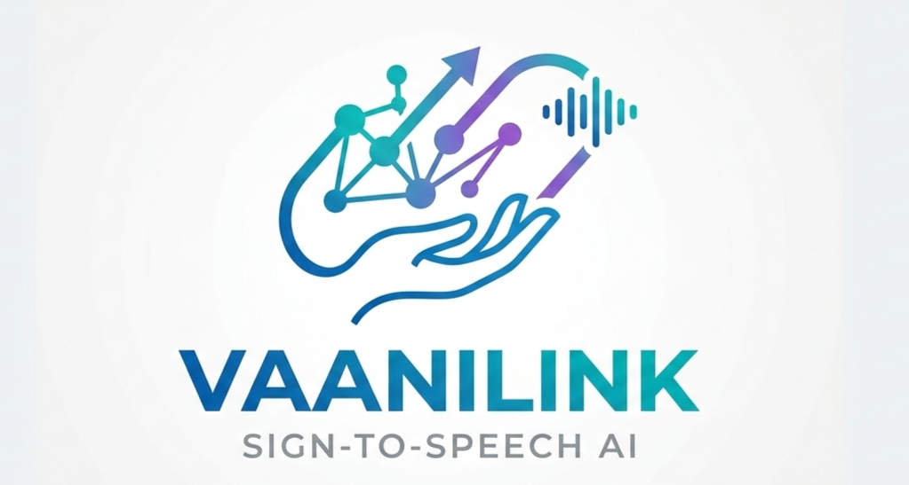

## VAANILINK – Sign-to-Speech AI

Vaanilink is a **real-time sign-language to speech** web app.  
It uses **MediaPipe hand landmarks** to detect gestures, converts them into **natural phrases**, and speaks them using **ElevenLabs** or the browser’s built-in TTS.

Designed for **daily communication and emergencies**, Vaanilink focuses on clarity, speed, and accessibility.

---

### Table of Contents

- [Features](#features)
- [Supported Gestures](#supported-gestures)
- [Tech Stack](#tech-stack)
- [Getting Started](#getting-started)
  - [Prerequisites](#prerequisites)
  - [Installation](#installation)
  - [Environment Variables](#environment-variables)
  - [Running the App](#running-the-app)
- [How It Works](#how-it-works)
  - [Gesture Detection “Brain”](#gesture-detection-brain)
  - [Voice Engine](#voice-engine)
  - [UI / UX](#ui--ux)
- [Production Notes](#production-notes)
- [Contributors & Roles](#contributors--roles)

---

## Features

- **Sign-to-speech in real time**  
  Uses the webcam to detect **hand gestures** and speaks out the mapped phrase. Designed for **short, high-signal phrases** (hello, help, water, stop, etc.).

- **Advanced gesture logic**  
  - Dynamic thresholds relative to **hand size** (distance from wrist to middle finger base) so it works from different camera distances.  
  - **Two-hand support** for richer vocabulary (e.g. combined gestures for “please” and “restroom”).  
  - **Debounced recognition**: gestures must be stable for several frames before they “lock in”, greatly reducing false triggers.

- **Emergency & daily-use phrases**  
  Includes gestures for **help**, **I need assistance**, **I need water**, **I need the restroom**, **please stop**, and more.

- **Voice engine with ElevenLabs**  
  - Uses ElevenLabs Text-to-Speech for high-quality audio.  
  - Falls back to the **browser’s own TTS** if ElevenLabs is unavailable or rate-limited.  
  - Rate limiting (via Upstash) protects your ElevenLabs credits from abuse.

- **Clean, modern interface**  
  Tailwind-based responsive UI with calibration overlay, real-time status messages, and elegant toast notifications (Sonner).  
  A **Transcript sidebar** keeps a history of what was “said” for use in contexts like medical visits.

- **Accessibility**  
  - **Dark / light mode** toggle with stored preference.  
  - **High-contrast design** and clear typography.  
  - Optional **haptic feedback** (vibration) on supported mobile devices when a gesture is successfully recognized.

---

## Supported Gestures

All gestures are recognized from a **single hand** unless noted.  
After a gesture is held still for long enough, the skeleton turns **green** and (on mobile) a small vibration is triggered. That means it “locked in” and will speak.

### Core communication

- **Hello** – open palm ✋  
  Thumb + all 4 fingers extended, palm facing the camera.

- **Goodbye** – waving hand  
  Same open hand as **Hello**, but move it **side-to-side**.

- **Yes** – fist 👊  
  All fingers curled into a tight fist.

- **Good, okay** – thumbs-up 👍  
  Only thumb extended, pointing clearly upward.

- **No** – thumbs-down 👎  
  Only thumb extended, pointing clearly downward.

- **Wait** – index up ☝  
  Only **index finger extended**, others curled in.

- **Help** – victory sign ✌  
  **Index + middle** fingers extended, ring+pinky curled.

- **Thank you** – four fingers up 🤚  
  Index–pinky extended, **thumb tucked**.

- **Please** (one-hand)  
  Open palm or four-finger hand, held **very still** in the **lower-middle** of the frame for ~0.7–1.1s.

- **Please** (two-hands / namaste-like)  
  Both hands open, palms together/close in front of the camera.

### Emergency / daily-use

- **I need assistance** – “I love you” sign 🤟  
  Thumb, index, and pinky extended; middle and ring curled.

- **I need water** – “W” hand  
  Thumb curled in. Index, middle, and ring fingers extended; pinky curled. Looks like the letter **W**.

- **I need the restroom** – two low fists  
  Make a **fist with each hand** (same as “Yes”) and hold **both fists low and close together** in the frame.

- **Please stop** – raised stable palm  
  Open palm held **still in the upper-middle** of the frame (roughly chest/face height) for ~0.7–1s.

---

## Tech Stack

- **Framework**: Next.js (App Router)
- **Language**: TypeScript + React
- **Styling**: Tailwind CSS (Next 16 / Tailwind v4 pipeline)
- **Motion / Animations**: `motion` (Framer Motion-compatible)
- **Hand Tracking**: `@mediapipe/tasks-vision` (`HandLandmarker`)
- **Toasts / Notifications**: `sonner`
- **Rate Limiting**: `@upstash/ratelimit` + `@upstash/redis`
- **Icons**: `lucide-react`

---

## Getting Started

### Prerequisites

- **Node.js** ≥ 18  
- **npm** (or another package manager; commands below use npm)
- A modern browser with webcam support.

Optional but recommended:

- **ElevenLabs API key** for high-quality TTS.
- **Upstash Redis** credentials for production-grade rate limiting.

### Installation

```bash
git clone https://github.com/ranakpix/vaanilink.git
cd vaanilink

npm install
```

### Environment Variables

Create a `.env.local` file in the project root:

```bash
ELEVENLABS_API_KEY=your_elevenlabs_api_key_here
# Optional: default voice and model
# ELEVENLABS_VOICE_ID=your_preferred_voice_id
# ELEVENLABS_MODEL_ID=eleven_turbo_v2_5

# Optional: Upstash Redis (for rate limiting /api/speak and /api/voices)
# UPSTASH_REDIS_REST_URL=...
# UPSTASH_REDIS_REST_TOKEN=...
```

- If `ELEVENLABS_API_KEY` is missing, the app will fall back to **browser TTS** only.  
- If your key **does not have `voices_read` permission**, the **Voice** dropdown will show a friendly message and use the default ElevenLabs voice automatically.  
- Upstash env vars are **optional**; without them, rate limiting is disabled (safe for local dev).

### Running the App

```bash
npm run dev
```

Then open:

- `http://localhost:3000` – Landing page  
- `http://localhost:3000/translator` – **Sign Language Translator**

---

## How It Works

### Gesture Detection “Brain”

Core logic lives in `components/HandTracker.tsx`:

- Uses **MediaPipe HandLandmarker** with `numHands: 2` to track up to two hands.  
- Normalizes thresholds based on a **hand-size measurement** (wrist → middle MCP), so distances scale whether the hand is close or far from the camera.  
- A **3-second calibration step** on camera start samples hand size and ambient brightness to build a stable baseline.

Recognition pipeline:

- Each frame, the classifier outputs a candidate `GestureId`.  
- A gesture only **locks in after ~10 consecutive confirming frames**.  
- On lock:
  - The skeleton turns **green**.  
  - Optional **vibration** is triggered (mobile/supporting devices).  
  - The phrase is spoken (with cooldown to prevent spam).  
  - The phrase and gesture ID are logged into the **Transcript** sidebar.

### Voice Engine

- Primary TTS runs through **`/api/speak`**, which:
  - Streams audio from ElevenLabs’ `text-to-speech/{voiceId}/stream`.  
  - Wraps calls with **Upstash rate limiting** (per IP per minute).
- If ElevenLabs fails or is unavailable:
  - A toast explains the issue.  
  - The app falls back to **`speechSynthesis`** in the browser.

**Voice selection:**

- `GET /api/voices` lists voices from ElevenLabs (if the key has `voices_read`).  
- The Translator page lets users **load and select a voice** from a dropdown.  
- If the key cannot list voices, the API returns a **warning** and the UI uses the **default voice** without breaking.

### UI / UX

- **Translator page** shows three main areas:
  - **Camera Feed** with hand skeleton overlay.  
  - **Translation Results** card with current output and actions:
    - Copy, Speak (browser TTS), Download, Save.  
    - Voice selection section.  
  - **Transcript sidebar** with a scrollable history of recent phrases and their timestamps.
- **Toasts** (via Sonner) surface:
  - Voice engine errors and fallbacks.  
  - Calibration completion.  
  - Voice loading status.
- **Header** uses the Vaanilink logo and provides navigation and theme toggle.  
- **ThemeToggle** supports **dark/light mode** with preference stored in `localStorage`.

---

## Production Notes

- **Build** the app:

```bash
npm run build
npm start
```

- Ensure environment variables are configured in your hosting provider (Vercel, etc.).  
- Consider enabling **Upstash Redis** in production to protect ElevenLabs credits.

---

## Contributors & Roles

- **Sayuj** – Team Leader & Lead Developer  
  - Led the project end‑to‑end, from concept to implementation.  
  - Drove architecture, core gesture logic, ElevenLabs and backend integration, and overall coordination.

- **Ranak** – Core Developer  
  - Contributed to full-stack implementation, infrastructure, and GitHub setup.  
  - Helped refine integrations between the front end, MediaPipe, and the backend APIs.

- **Shreyashi** – Gesture & Interaction Design  
  - Mapped real-world sign shapes to robust detection logic.  
  - Helped tune thresholds and define practical, daily-use and emergency gestures.

- **Shinjini** – UX Research & Testing  
  - Ensured gestures are understandable, repeatable, and usable in realistic scenarios.  
  - Provided feedback on calibration, timings, and overall usability.

- **Bhumika** – Accessibility & Content  
  - Focused on clear phrases, high-contrast UI, and supporting use cases like medical visits and emergencies.  
  - Helped refine the transcript flow, emergency phrases, and wording.

This is a [Next.js](https://nextjs.org) project bootstrapped with [`create-next-app`](https://nextjs.org/docs/app/api-reference/cli/create-next-app).

## Getting Started

First, run the development server:

```bash
npm run dev
# or
yarn dev
# or
pnpm dev
# or
bun dev
```

Open [http://localhost:3000](http://localhost:3000) with your browser to see the result.

You can start editing the page by modifying `app/page.tsx`. The page auto-updates as you edit the file.

This project uses [`next/font`](https://nextjs.org/docs/app/building-your-application/optimizing/fonts) to automatically optimize and load [Geist](https://vercel.com/font), a new font family for Vercel.

## Learn More

To learn more about Next.js, take a look at the following resources:

- [Next.js Documentation](https://nextjs.org/docs) - learn about Next.js features and API.
- [Learn Next.js](https://nextjs.org/learn) - an interactive Next.js tutorial.

You can check out [the Next.js GitHub repository](https://github.com/vercel/next.js) - your feedback and contributions are welcome!

## Deploy on Vercel

The easiest way to deploy your Next.js app is to use the [Vercel Platform](https://vercel.com/new?utm_medium=default-template&filter=next.js&utm_source=create-next-app&utm_campaign=create-next-app-readme) from the creators of Next.js.

Check out our [Next.js deployment documentation](https://nextjs.org/docs/app/building-your-application/deploying) for more details.
